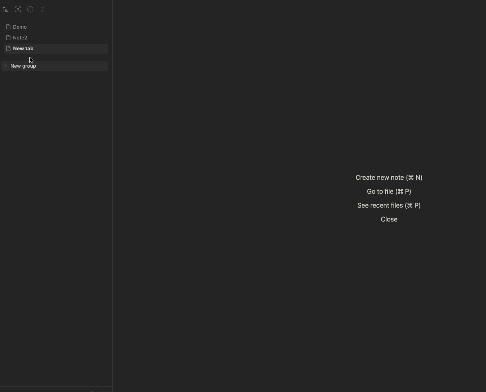

# Hover to Reveal Sidebar
This is an Obsidian plugin that allows you to toggle open/close sidebars. 
It is designed to be used alongside [Vertical Tabs](https://github.com/oxdc/obsidian-vertical-tabs)
By using this plugin, you can have an Arc browser-like experience in your Obsidian vault.

## Features

- Hover to open sidebars
- Works seamlessly with Vertical Tabs plugin
- Achieve better focus with minimal UI elements

## How is this plugin different from other hover-to-open-sidebar plugins
1. You can detect sidebar hover even when you disable `Show Ribbon` on the left edge
2. You can drag and drop tab items in the sidebar

## Recommended Settings
- Install [Vertical Tabs](https://github.com/oxdc/obsidian-vertical-tabs)
- Disable `Settings` > `Appearance` > `Show Ribbon` 
- Use [Hider Plugin](https://github.com/kepano/obsidian-hider) to hide tabs 

## Inspirations
- [Arc  browser](https://arc.net/)
- [Open Sidebar on Hover](https://github.com/AnAngryRaven/obsidian-open-sidebar-on-hover)

## Manual Installation
1. Download the latest release from the [Releases page](https://github.com/tofujlg/hover_to_open_sidebar_for_vertical_tabs/releases/)
2. Extract the downloaded zip file(`manifest.json`, `main.js`,`styles.css`)
3. Move the extracted folder to your Obsidian vault's plugins directory: `.obsidian/plugins/`
 - You should have something like this (.obsidian/plugins/hover_to_open_sidebar_for_vertical_tabs/)
4. Reload Obsidian and enable the "Hover to Reveal Sidebar" plugin in Settings > Community plugins
5. Enjoy! 